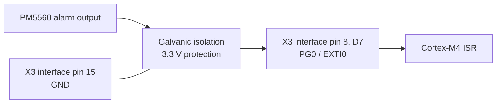
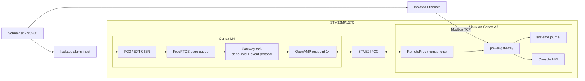
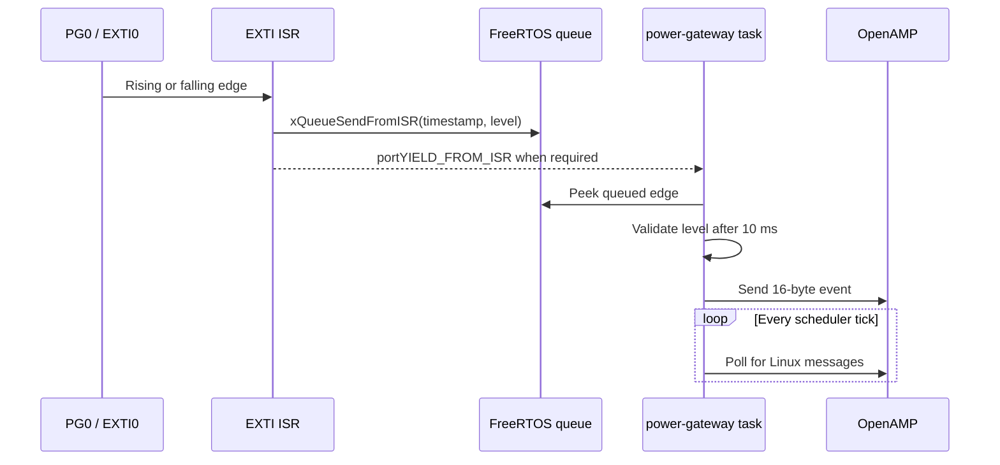
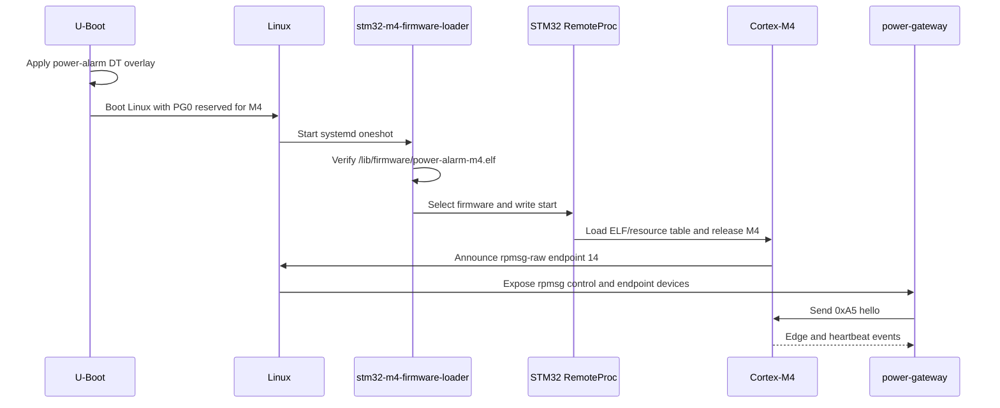

# phyCORE-STM32MP1 Power Instrumentation Gateway

## Product Requirements Document

| Field | Value |
|---|---|
| Status | Prototype, hardware validation pending |
| Version | 0.4 |
| Date | 2026-07-30 |
| SOM | PHYTEC phyCORE-STM32MP1 with STM32MP157C |
| Carrier | PHYTEC phyBOARD-Sargas, PCB 1517.2 |
| BSP | BSP-Yocto-OpenSTLinux-STM32MP1-PD23.1.0 |
| Yocto machine | `phycore-stm32mp1-3` |
| Meter | Schneider Electric PowerLogic PM5560 |
| HMI | Raspberry Pi official 7-inch DSI display |

## 1. Product Summary

The gateway polls one PM5560 over Modbus TCP, validates readings, records
structured events in `systemd-journald`, and presents values and alarms on a
local LCD.

The STM32MP157C is used as a heterogeneous processor:

- Linux on the Cortex-A7 cores owns Ethernet, Modbus TCP, journaling, storage,
  firewalling, and the HMI.
- FreeRTOS firmware from STM32CubeMP1 on the Cortex-M4 owns one alarm GPIO and
  its EXTI interrupt.
- STM32 IPCC and OpenAMP/RPMsg transport alarm events from M4 to Linux.
- An interrupt is a notification. Linux performs a priority Modbus read to
  obtain authoritative meter data after receiving an edge.

In Modbus terminology the PM5560 is the server and this gateway is the client.

## 2. Goals

- Poll a fixed PM5560 profile over isolated Ethernet.
- Capture alarm assertion and clear edges independently of Linux scheduling.
- Relay ordered M4 events with a monotonic timestamp and overflow counter.
- Perform an immediate priority read after each alarm event.
- Log readings, state changes, failures, recovery, and alarm confirmation.
- Show meter, M4-link, and alarm state on a minimal local LCD.
- Recover services and M4 firmware automatically after reboot or failure.
- Keep PHYTEC-specific integration in one small Yocto layer.

## 3. Non-Goals

- Breaker tripping, protection relay behavior, or safety-certified control.
- Modbus writes, arbitrary meter discovery, or a cloud service.
- IEC 61850, DNP3, OPC UA, MQTT, or Modbus RTU.
- Remote firmware update infrastructure.

## 4. Selected Hardware

### 4.1 Compute, Carrier, and Display

- phyCORE-STM32MP1 SOM populated with STM32MP157C.
- phyBOARD-Sargas carrier, PCB 1517.2.
- Carrier Ethernet connected to an isolated instrumentation network.
- Raspberry Pi official 7-inch DSI display using PHYTEC overlay
  `phyboard-stm32mp1-dsi-rpi-official-display`.
- Industrial power supply and carrier-level EMC protection.

### 4.2 Meter

The Schneider PowerLogic PM5560 supplies:

- measurements through read-only Modbus TCP on TCP/502;
- a configured alarm output routed through galvanic isolation to Arduino D7.

The meter register addresses and alarm-output behavior must be commissioned
against the exact installed PM5560 firmware and wiring mode.

### 4.3 Fixed Alarm GPIO Allocation

| Attribute | Allocation |
|---|---|
| Carrier connector | X3 Arduino header |
| Alarm input | Interface pin 8 (`D7`) |
| Signal | `X_DFSDM1_DATIN0/PG0` |
| Ground reference | Interface pin 15 (`GND`) |
| SoC GPIO | `GPIOG`, pin 0 |
| Interrupt | `EXTI0`, rising and falling edges |
| Logic | 3.3 V, pull-down, active high |
| Runtime owner | Cortex-M4 |
| Linux reservation | `m4_system_resources` / `rproc-srm-dev` |

PHYTEC documents Arduino D7 as a direct 3.3 V GPIO or DFSDM input. It defaults
to GPIO, needs no carrier jumper, and is convenient for prototype wiring. The
field signal shall pass through an isolated, surge-protected, current-limited
3.3 V input stage.



## 5. System Architecture



### 5.1 Event Contract

The packed little-endian event is 16 bytes:

| Field | Type | Meaning |
|---|---|---|
| version | `uint8_t` | Protocol version, initially 1 |
| type | `uint8_t` | Edge, heartbeat, or overflow |
| input_level | `uint8_t` | Debounced active-high alarm state |
| reserved | `uint8_t` | Zero |
| sequence | `uint32_t` | Incrementing event sequence |
| m4_ticks | `uint32_t` | M4 millisecond tick at capture |
| overflow_count | `uint32_t` | Cumulative ISR queue overflow |

Runtime channel:

- M4 OpenAMP service: `rpmsg-raw`;
- M4 endpoint: 14;
- Linux endpoint: dynamically allocated through `/dev/rpmsg_ctrl0`;
- Linux hello: one byte `0xA5`;
- heartbeat: every five seconds.

### 5.2 FreeRTOS Execution Model



The EXTI interrupt priority is set to
`configLIBRARY_MAX_SYSCALL_INTERRUPT_PRIORITY`, allowing the ISR to use the
FreeRTOS `FromISR` API. A single task owns OpenAMP initialization, polling,
receive callbacks, and sends because the STM32CubeMP1 `v1.6.0`
libmetal/OpenAMP integration is not generally thread-safe. OpenAMP callbacks
must not call FreeRTOS synchronization functions.

### 5.3 Boot and Firmware Loading

The M4 ELF is loaded at every boot. It is not permanently flashed into a
separate microcontroller.



The loader discovers the RemoteProc node from its name instead of assuming
`remoteproc0`. It handles both `offline` and bootloader-started `detached`
states and requires `running` within five seconds.

### 5.3 GPIO and EXTI Ownership

Linux shall apply `phyboard-sargas-power-alarm.dtbo`. The overlay:

- reserves PG0 with the STM32 `RSVD` pinmux state;
- declares GPIOG pin 0 with both-edge triggering under
  `m4_system_resources`;
- enables the STM32 M4 RemoteProc node;
- selects `power-alarm-m4.elf`.

The image shall also apply
`phyboard-stm32mp1-dsi-rpi-official-display.dtbo` for the selected HMI.

STM32Cube firmware configures the reserved pin as a pull-down GPIO input and
uses the Resource Manager lock service. GPIO configuration is protected by
HSEM 0 and EXTI configuration by HSEM 1. Linux must not create another GPIO
consumer for PG0.

## 6. Pinned Software and Toolchain

### 6.1 Linux BSP

| Component | Version |
|---|---|
| PHYTEC BSP | `BSP-Yocto-OpenSTLinux-STM32MP1-PD23.1.0` |
| Yocto release | Kirkstone |
| Machine | `phycore-stm32mp1-3` |
| Distro/image | `openstlinux-weston` / `st-image-weston` |
| Linux baseline | `5.15.67-stm32mp-r2` |

### 6.2 Cortex-M4

| Component | Version |
|---|---|
| STM32CubeMP1 | `v1.6.0` |
| STM32CubeMP1 commit | `b9a31179d5bf80b3958c3653153bfd4c3a7fc5d5` |
| Cross compiler | GNU Arm Embedded `11.2-2022.02` from `gcc-arm-none-eabi-native` |
| RTOS | FreeRTOS supplied by STM32CubeMP1 `v1.6.0` |
| Reference project | `STM32MP157C-DK2/Applications/OpenAMP/OpenAMP_FreeRTOS_echo` |

The reference project supplies the linker script, resource table, IPCC,
OpenAMP, FreeRTOS, startup, and HAL integration. The repository Makefile
compiles the gateway and pinned ST sources during `do_compile`; the recipe
installs the ELF for RemoteProc without requiring STM32CubeIDE or a prebuilt
binary.

## 7. Functional Requirements

### FR-1 Modbus Polling

- Poll one statically configured PM5560 as a read-only Modbus TCP client.
- Keep register addresses and types in a versioned meter profile.
- Use a one-second default cadence with bounded reconnect backoff.
- Do not block M4 event processing while the meter is unavailable.
- Trigger a priority read after each alarm edge.

### FR-2 M4 Interrupt Capture

- Configure PG0 as active-high input with pull-down.
- Configure EXTI0 for both rising and falling edges.
- Keep the ISR bounded to timestamp, sample, and queue operations.
- Post edges with `xQueueSendFromISR()` at an RTOS-safe interrupt priority.
- Debounce for 10 ms outside the ISR.
- Count queue overflow and include the count in every event.

### FR-3 IPC and Supervision

- Initialize OpenAMP only in production mode after Linux RemoteProc starts M4.
- Perform every OpenAMP API call from the single gateway task.
- Require the Linux hello before sending application events.
- Reject events with the wrong version or size.
- Detect missing sequence values.
- Mark the M4 link degraded after 15 seconds without an event.
- Recreate RPMsg endpoints without requiring a Linux reboot.

### FR-4 Journaling

- Emit structured journal fields for meter identity, event type, alarm state,
  sequence, communication status, and priority-read result.
- Log changes and periodic summaries rather than every unchanged register.
- Bound journal storage by size and retention time.

### FR-5 HMI

- Show meter connectivity, M4 link state, alarm state, and a compact value
  summary.
- Use the framebuffer console for the prototype.
- Show `DEGRADED` without hiding valid Modbus data when M4 is unavailable.
- Require no desktop environment or touch configuration workflow.

### FR-6 Recovery

- systemd shall restart Linux services after failure.
- RemoteProc loading shall fail visibly when the ELF is missing or M4 does not
  enter `running`.
- Modbus reconnect, RPMsg recreation, and HMI refresh shall be automatic.

## 8. Yocto Layer

```text
meta-power-gateway/
|-- conf/layer.conf
|-- dynamic-layers/
|   `-- stm-st-stm32mp/
|       `-- recipes-core/images/st-image-weston.bbappend
|-- recipes-apps/
|   |-- power-gateway/
|   `-- power-hmi/
|-- recipes-bsp/
|   |-- device-tree-overlays/
|   |-- m4-alarm-firmware/
|   `-- stm32-m4-firmware-loader/
`-- recipes-core/
    |-- packagegroups/
    `-- power-gateway-config/
```

The M4 recipe builds the ELF from source as part of `st-image-weston`.
Physical GPIO, timing, and OpenAMP tests remain required on the target.

## 9. Security and Operations

- Put the meter network on an isolated OT VLAN.
- Permit only required outbound TCP/502 traffic.
- Do not expose a Modbus server in the hardware image.
- Use SSH keys on a separate maintenance interface.
- Keep credentials out of the layer.
- Bound journal writes and retention.

Useful commands:

```sh
systemctl status stm32-m4-firmware-loader power-gateway power-hmi
cat /sys/class/remoteproc/remoteproc*/name
cat /sys/class/remoteproc/remoteproc*/state
journalctl -u power-gateway --since today
cat /run/power-gateway/status
```

## 10. Acceptance Criteria

1. The image boots on `phycore-stm32mp1-3` with the DSI display and Ethernet.
2. PG0 is absent from Linux GPIO consumers and declared to `rproc-srm`.
3. RemoteProc loads `power-alarm-m4.elf` and reports `running`.
4. RPMsg endpoint creation and hello/event exchange survive service restart.
5. A stable Arduino D7 assertion or clear produces exactly one debounced edge
   event.
6. Event sequence increases and queue overflow remains zero under rated load.
7. The 99th-percentile edge-to-Linux latency is below 50 ms.
8. An edge triggers a priority Modbus read while normal polling continues.
9. Meter disconnect and recovery require no reboot.
10. Alarm and degraded states appear in the journal and on the LCD.
11. The gateway runs for 72 hours without unbounded memory or journal growth.

## 11. Risks and Decisions

| Risk | Mitigation |
|---|---|
| Field voltage damages Arduino D7 or the SoC | Use galvanic isolation and protected 3.3 V conditioning |
| Linux and M4 contend for PG0/EXTI0 | Declare resources through `m4_system_resources` and use HSEM locks |
| Saved U-Boot environment overrides `overlays.txt` | Clear or update the U-Boot `overlay` variable during commissioning |
| Reference linker/resource table differs from BSP | Validate ELF loading and reserved-memory addresses against PD23.1.0 |
| PM5560 register map differs by firmware | Freeze meter firmware and use its matching Schneider register list |
| RPMsg node numbering changes | Discover RemoteProc by name and commission device-node mapping |
| LCD console is unavailable | Verify framebuffer console; replace HMI renderer if required |

## 12. Bring-Up Order

1. Build and boot the unmodified PHYTEC PD23.1.0 BSP.
2. Validate Ethernet and the selected DSI display overlay.
3. Add the gateway layer and verify the PG0 resource overlay is applied.
4. Validate Arduino D7 with a protected 3.3 V test source.
5. Build `m4-alarm-firmware` through BitBake and inspect the ELF resource table.
6. Build the image and verify the ELF is installed under `/lib/firmware`.
7. Start M4 through Linux RemoteProc and validate OpenAMP endpoint 14.
8. Validate edge, heartbeat, sequence, restart, and latency behavior.
9. Commission read-only PM5560 registers and priority reads.
10. Validate HMI, journaling, firewall, and retention.
11. Freeze module, carrier, BSP, meter firmware, register map, and M4 versions.

## 13. References

- [PHYTEC phyCORE-STM32MP15x/phyBOARD-Sargas hardware manual](https://www.phytec.de/cdocuments/?doc=joCZOg)
- [PHYTEC STM32MP1 BSP guide and device-tree overlays](https://www.phytec.de/cdocuments/?doc=GQDgGQ)
- [PHYTEC OpenSTLinux PD23.1.0 image manifest](https://download.phytec.de/Software/Linux/BSP-Yocto-STM32MP1/BSP-Yocto-OpenSTLinux-STM32MP1-PD23.1.0/images/phycore-stm32mp1-3/st-image-weston-openstlinux-weston-phycore-stm32mp1-3-license_content.html)
- [ST Linux RemoteProc framework](https://wiki.st.com/stm32mpu/wiki/Linux_remoteproc_framework_overview)
- [ST Linux RPMsg framework](https://wiki.st.com/stm32mpu/wiki/Linux_RPMsg_framework_overview)
- [ST system-resource configuration](https://wiki.st.com/stm32mpu/wiki/How_to_configure_system_resources)
- [ST STM32CubeMP1 package](https://www.st.com/en/embedded-software/stm32cubemp1.html)
- [Schneider PM5560 datasheet](https://iportal.se.com/Contents/docs/POWERLOGIC%20PM5000%20SERIES_METSEPM5560_DATASHEET.PDF)
