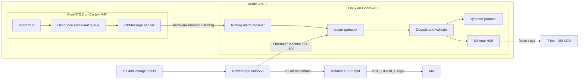
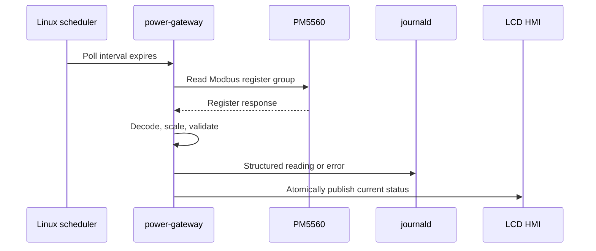
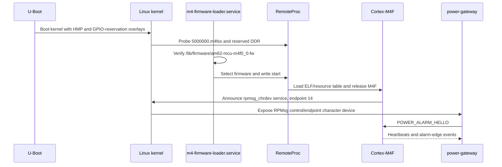

# Verdin AM62 Power Instrumentation Gateway

## Product Requirements Document

| Field | Value |
|---|---|
| Status | Draft for prototype |
| Version | 0.3 |
| Date | 2026-07-29 |
| Compute module | Toradex Verdin AM62, MIPI-DSI capable variant |
| Linux image | Toradex Reference Minimal Image extended by Yocto |
| Meter | Schneider Electric PowerLogic PM5560 |
| HMI | Toradex 7-inch capacitive-touch DSI display |

## 1. Product Summary

The product is a compact electrical-instrumentation gateway. A Verdin AM62
polls one Schneider Electric PowerLogic PM5560 over Modbus TCP, validates the
measurements, logs structured records to `systemd-journald`, and presents
current values and alarms on a local LCD.

The AM62 is used as a heterogeneous system:

- Linux on the Cortex-A53 cores owns Ethernet, Modbus TCP polling, data
  processing, journaling, and the HMI.
- FreeRTOS on the Cortex-M4F owns a dedicated alarm input from the meter. Its
  GPIO interrupt service routine captures alarm edges with bounded latency and
  relays events to Linux through TI RPMessage/RPMsg.
- An interrupt is a fast notification, not the measurement payload. Linux
  performs a priority Modbus read after an alarm event to obtain and confirm
  the meter's alarm state and related measurements.

In Modbus terminology, the PM5560 is the server and the gateway is the client.

## 2. Goals

- Poll PM5560 measurements over isolated Ethernet using Modbus TCP.
- Detect a configured PM5560 alarm without waiting for the next polling cycle.
- Keep hard real-time GPIO interrupt handling out of Linux user space.
- Relay M4F alarm events to Linux with sequence and monotonic timestamp data.
- Log readings, state changes, alarms, communication failures, and recovery
  events as structured journal entries.
- Show a simple, glanceable local HMI without a desktop environment.
- Recover automatically after meter, network, M4F, service, or power failures.
- Keep all product integration in a small `meta-power-gateway` layer.

## 3. Non-Goals

- Protection, breaker tripping, or other safety-critical closed-loop control.
- Replacing a protection relay, PLC, or certified energy management system.
- A browser UI, cloud backend, historian, or remote firmware update system.
- Touch-driven configuration in the first release.
- Modbus register writes.
- Support for arbitrary meter models.
- IEC 61850, DNP3, OPC UA, MQTT, Modbus RTU, or RS-485.

## 4. Selected Hardware

### 4.1 Compute and Display

- Toradex Verdin AM62 with Cortex-A53 Linux cores and Cortex-M4F MCU core.
- Carrier with:
  - one Ethernet connection for the meter network;
  - one MIPI DSI display connection;
  - one exposed MCU-domain GPIO;
  - industrial DC input and appropriate EMC protection.
- Toradex 7-inch capacitive-touch DSI display.

For a prototype, use a Verdin Development Board or Dahlia plus the Toradex DSI
Display Adapter. A Mallow carrier can connect the display directly. The chosen
Verdin AM62 orderable variant must support MIPI DSI.

The prototype alarm input is allocated to `MCU_GPIO0_1`, exposed as Verdin
SODIMM pin 206. This allocation is fixed for the prototype:

| Attribute | Allocation |
|---|---|
| Verdin connector | X1 / SODIMM 206 (`GPIO_1`) |
| AM62 ball | B8 |
| Pad reset function | `MCU_SPI0_CS1` |
| Selected mux | ALT7 |
| Mux function | `MCU_GPIO0_1` |
| GPIO location | MCU GPIO controller 0, pin 1, bank 0 |
| Direction and trigger | input, rising and falling edges |
| Owner | Cortex-M4F only |
| I/O voltage | 1.8 V |

Linux shall reserve both `mcu_gpio0` and `mcu_gpio_intr`. TI SysConfig shall
configure the pad mux and route bank 0 to the M4F NVIC. A GPIO bank interrupt
cannot be routed to Linux and M4F simultaneously.

The production carrier schematic and exact module datasheet revision shall be
checked before layout. The PM5560 output must never be wired directly to the SoM
pin; it requires the protected input stage described below.

### 4.2 Meter

The supported meter is the Schneider Electric PowerLogic PM5560
(`METSEPM5560`). Relevant capabilities are:

- 10/100 Ethernet and Modbus TCP;
- three-phase voltage, current, active/reactive/apparent power, power factor,
  frequency, energy, demand, and harmonic measurements;
- two Form A digital outputs, D1 and D2;
- alarm-driven digital-output operation configured through the meter.

The PM5560 D1 output is configured to represent the MVP alarm condition. A
carrier-board isolated input stage converts the field contact/output to clean
1.8 V logic for the M4F GPIO. It shall include galvanic isolation where
required, current limiting, surge protection, a defined inactive level, and
Schmitt-trigger conditioning or equivalent.

### 4.3 Example Network Values

| Setting | Prototype value |
|---|---|
| Meter identifier | `pm5560-main-incomer` |
| PM5560 address | `192.168.20.50` |
| Gateway address | `192.168.20.10/24` |
| Modbus TCP port | `502` |
| Unit ID | `255`, confirmed during commissioning |
| Connect/response timeout | 1 second |
| Retry count | 1 |
| Reconnect backoff | 1 to 60 seconds |

## 5. Architecture



### 5.1 Normal Polling Path



### 5.2 Alarm Interrupt Path

```mermaid
sequenceDiagram
    participant P as PM5560 D1
    participant I as Isolated input
    participant M as M4F FreeRTOS
    participant R as Linux RPMsg
    participant G as power-gateway
    participant J as journald
    participant H as LCD HMI

    P->>I: Alarm output changes state
    I->>M: MCU GPIO edge interrupt
    M->>M: Capture level, ticks, sequence; enqueue
    M-->>R: ALARM_EDGE event over RPMessage
    R-->>G: Event delivered
    G->>J: Log preliminary alarm edge
    G->>P: Priority Modbus read
    P-->>G: Alarm status and measurements
    G->>J: Log confirmed alarm context
    G->>H: Display alarm
```

### 5.3 Design Rationale

> "The A53 Linux side polls the PM5560 because Modbus TCP is a request-response
> protocol and Linux is the right place for Ethernet, parsing, journaling, and
> the display. For a time-sensitive alarm, the meter's D1 output is isolated
> and connected to an MCU-domain GPIO. The AM62 M4F handles that GPIO interrupt
> under FreeRTOS, timestamps and queues the edge, and sends a small RPMsg event
> to Linux. Linux immediately performs a priority Modbus read to confirm the
> alarm and obtain full engineering data. This gives a fast notification path
> without pretending that the interrupt replaces Modbus data acquisition."

### 5.4 Hardware Boot and Firmware Load

The M4F application is not permanently flashed into a separate M4 device.
Linux RemoteProc copies the ELF firmware from the root filesystem into the AM62
M4F memory regions and starts the core on each boot.



At boot, Toradex U-Boot shall apply:

- `verdin-am62_hmp_overlay.dtbo`;
- `verdin-am62_power-alarm_overlay.dtbo`;
- `verdin-am62_panel-cap-touch-7inch-dsi_overlay.dtbo`.

Yocto shall list these in `TEZI_EXTERNAL_KERNEL_DEVICETREE_BOOT`, which produces
the `fdt_overlays` entry consumed from `overlays.txt`.

## 6. Functional Requirements

### FR-1 Linux Modbus Polling

- `power-gateway` shall operate as a read-only Modbus TCP client.
- It shall poll one statically configured PM5560.
- Register addresses and data types shall reside in a versioned meter profile
  matched to the installed PM5560 firmware.
- Adjacent registers may be combined only when the vendor register map permits.
- A slow or disconnected meter shall not block M4F alarm event processing.
- A received interrupt shall request an immediate high-priority alarm/status
  read without permanently changing the normal polling cadence.

Initial polling groups:

| Group | Data | Interval |
|---|---|---:|
| Fast | phase voltage/current, total active power, frequency | 1 second |
| Totals | reactive/apparent power, power factor, demand | 5 seconds |
| Energy | imported/exported active and reactive energy | 60 seconds |
| Quality | configured voltage/current THD values | 60 seconds |
| State | meter diagnostics and configured alarm registers | 10 seconds |

### FR-2 M4F Interrupt Capture

- The M4F firmware shall use AM62x MCU+ SDK `12.00.00.27`, TI ARM Clang
  `4.0.1.LTS`, SysConfig `1.26.2`, FreeRTOS, and the `am62x-sk` platform
  variant.
- `MCU_GPIO0_1` shall be reserved from Linux and owned only by the M4F.
- Both assertion and deassertion edges shall be captured.
- The ISR shall only read the input, capture a monotonic tick, increment a
  sequence number, and enqueue an event using ISR-safe APIs.
- Debounce, RPMessage transmission, retries, and logging shall execute in task
  context, never in the ISR.
- Default debounce time shall be 10 ms and configurable at firmware build time.
- The queue shall hold at least 32 events. Overflow shall increment a persistent
  runtime counter included in the next transmitted event.
- The GPIO bank interrupt routing shall not be shared with Linux.

### FR-3 M4F-to-Linux Event Contract

The firmware shall announce the Linux-recognized `rpmsg_chrdev` service on M4F
endpoint 14. Linux uses `RPMSG_CREATE_EPT_IOCTL` on `/dev/rpmsg_ctrl0` to
create `/dev/rpmsg0`, names the endpoint `power-alarm`, targets M4 endpoint 14,
and sends a one-byte `0xA5` hello. The M4F records the sender endpoint and only
then sends events. The protocol is versioned and little-endian.

```c
struct power_alarm_event_v1 {
    uint8_t  version;       /* 1 */
    uint8_t  type;          /* 1=edge, 2=heartbeat, 3=overflow */
    uint8_t  input_level;   /* 0 or 1 */
    uint8_t  reserved;
    uint32_t sequence;
    uint32_t m4_ticks;
    uint32_t overflow_count;
};
```

- M4F shall emit a heartbeat every 5 seconds.
- Linux shall detect duplicate or missing sequence numbers.
- Linux shall treat the M4F tick as relative timing only. Linux reception time,
  taken from the synchronized Linux clock, is the journal event timestamp.
- Loss of heartbeat for 15 seconds shall set `M4_LINK=degraded` and show an HMI
  fault without stopping Modbus polling.
- RPMsg event latency target, measured from debounced input edge to Linux
  user-space receipt, is less than 50 ms at the 99th percentile under the
  defined CPU and I/O load. This is a product target, not a safety guarantee.

### FR-4 Data Validation and Journaling

- Reject malformed Modbus frames and non-finite decoded values.
- Apply configurable engineering-range and rate-of-change checks.
- Log state changes immediately.
- Rate-limit repeated identical communication failures.
- Publish periodic healthy summaries rather than every unchanged 1-second
  sample, to limit eMMC writes.
- Use these journal fields where applicable:

| Field | Example |
|---|---|
| `MESSAGE_ID` | stable UUID per event class |
| `METER_ID` | `pm5560-main-incomer` |
| `EVENT_TYPE` | `measurement`, `alarm-edge`, `alarm-confirmed`, `health` |
| `QUALITY` | `good`, `stale`, `invalid`, `comm-error` |
| `ALARM_STATE` | `active`, `clear`, `unknown` |
| `M4_SEQUENCE` | `1042` |
| `M4_TICKS` | `8821045` |
| `VOLTAGE_L1_V` | `230.4` |
| `CURRENT_L1_A` | `18.7` |
| `ACTIVE_POWER_KW` | `11.9` |

### FR-5 Minimal HMI

The display shall be a status surface, not a configuration UI.

```text
+--------------------------------------------------+
| POWER GATEWAY                         14:32:08 UTC|
| Meter: ONLINE        M4 link: OK                 |
|                                                  |
| L1  230.4 V    18.7 A       Total  11.9 kW       |
| L2  229.8 V    18.1 A       Frequency 50.01 Hz   |
| L3  231.0 V    19.0 A                            |
|                                                  |
| ALARM: OVERCURRENT - ACTIVE                      |
+--------------------------------------------------+
```

- The prototype HMI shall use the kernel framebuffer console on `/dev/tty1`.
- `power-hmi` shall render a fixed text dashboard from an atomically replaced
  status file produced by `power-gateway`.
- No Weston, X11, browser, Qt, or touch input is required.
- Normal state uses standard console colors; active alarm uses red background
  and high-contrast text. Meaning shall also be conveyed by words, not color
  alone.
- Data older than 3 seconds shall be shown as `STALE`.
- Alarm indication shall remain until a confirmed clear state is read from the
  PM5560.
- Failure to open the display shall not stop acquisition or journaling.

The deployed kernel must provide DSI display support and framebuffer-console
binding. If the selected Toradex BSP does not expose fbcon for this DRM device,
a small direct-DRM renderer becomes a required follow-up; it is not silently
substituted in the MVP.

### FR-6 Supervision and Recovery

- systemd shall restart both Linux services after failure.
- `power-gateway` shall start after the network and M4 remote processor.
- Modbus polling shall recover with bounded exponential reconnect backoff.
- RemoteProc shall load the M4F binary as
  `/lib/firmware/am62-mcu-m4f0_0-fw`.
- `m4-firmware-loader.service` shall find the RemoteProc node by its
  `5000000.m4f` name rather than assuming `remoteproc0`.
- The loader shall verify that the firmware exists, request `start`, and fail if
  the core does not report `running` within five seconds.
- M4F restart or RPMsg recreation shall not require a Linux reboot.
- The Linux watchdog shall be enabled for production after hardware validation.

## 7. Yocto Integration

The repository includes a deliberately small layer:

```text
meta-power-gateway/
|-- conf/layer.conf
|-- recipes-core/
|   |-- images/
|   |   `-- tdx-reference-minimal-image.bbappend
|   `-- packagegroups/packagegroup-power-gateway.bb
|-- recipes-apps/
|   |-- power-gateway/
|   |   |-- power-gateway_0.1.bb
|   |   `-- files/
|   |       |-- power-gateway.c
|   |       |-- power-gateway.conf
|   |       `-- power-gateway.service
|   `-- power-hmi/
|       |-- power-hmi_0.1.bb
|       `-- files/
|           |-- power-hmi
|           `-- power-hmi.service
|-- recipes-bsp/
|   |-- device-tree-overlays/
|   |   `-- verdin-am62-power-alarm-overlay_0.1.bb
|   |-- m4-firmware-loader/
|   |   `-- m4-firmware-loader_0.1.bb
|   `-- m4-alarm-firmware/
|       `-- m4-alarm-firmware_0.2.bb.disabled
`-- recipes-core/
    `-- power-gateway-config/
        |-- power-gateway-config_0.1.bb
        `-- files/
            |-- journald-power-gateway.conf
            `-- power-gateway.nft

m4-firmware/
|-- config/power-alarm-pin.json
|-- include/
|-- scripts/
`-- src/
```

The disabled binary recipe is intentional. The proprietary TI toolchain and
SysConfig output are built outside BitBake. The active layer remains buildable
without an unverified binary; after hardware validation, the release ELF is
added to the recipe and the recipe is enabled. The RemoteProc loader is active
but starts only when that firmware file is installed.

### BSP Configuration

The image integration shall:

- add `packagegroup-power-gateway`;
- enable `systemd`, `systemd-journald`, RemoteProc, RPMsg character-device
  support, nftables, and framebuffer console support;
- apply Toradex's Verdin AM62 HMP and 7-inch DSI display overlays;
- compile and apply `verdin-am62_power-alarm_overlay.dts`, reserving
  `mcu_gpio0` and `mcu_gpio_intr` from Linux;
- keep product recipes out of Toradex and upstream layers.

For Toradex BSP 7.x, the expected prebuilt overlay names are:

- `verdin-am62_hmp_overlay.dtbo`
- `verdin-am62_panel-cap-touch-7inch-dsi_overlay.dtbo`

Overlay names and compatibility shall be rechecked for the exact BSP release.

## 8. Security and Operations

- Place the PM5560 and gateway OT interface on a non-routed VLAN or isolated
  switch.
- Permit outbound TCP/502 only from the gateway to the configured meter.
- Do not expose a Modbus server on the gateway.
- Disable unused listening services in the production image.
- Use SSH keys only on the maintenance interface.
- Store no credentials in the layer.
- Bound journal retention by size and time; keep at least seven days under the
  expected event rate.

Operational commands:

```sh
systemctl status power-gateway power-hmi
journalctl -u power-gateway --since today
journalctl METER_ID=pm5560-main-incomer
cat /sys/class/remoteproc/remoteproc*/state
```

## 9. Acceptance Criteria

1. The gateway runs for 72 hours while polling the PM5560 with no unhandled
   service restart or unbounded memory growth.
2. Engineering values match the PM5560 front panel or a calibrated reference
   within the meter and installation accuracy limits.
3. Disconnecting Ethernet produces a bounded communication alarm; reconnecting
   restores polling without reboot.
4. Toggling the isolated D1 test input produces an M4F event with increasing
   sequence number and causes an immediate priority Modbus read.
5. The 99th-percentile edge-to-Linux event latency is below 50 ms under
   representative CPU, network, and journal load.
6. A 20 ms input pulse is captured once; configured contact bounce does not
   create duplicate confirmed alarms.
7. Stopping the M4F firmware changes the HMI M4 link state to `DEGRADED` within
   15 seconds while normal Modbus polling continues.
8. Active and cleared alarms are visible on the LCD and in structured journal
   queries.
9. Power cycling the meter, display, or gateway returns the product to normal
   operation without manual service intervention.
10. Journal usage remains within its configured retention bound.
## 10. Risks and Decisions

| Risk | Mitigation |
|---|---|
| PM5560 register layout differs by firmware | Commission firmware version and use its matching Schneider register list |
| Digital output electrical levels damage SoM | Isolated, protected 1.8 V carrier input; schematic review before connection |
| Linux and M4 both claim GPIO bank interrupt | Reserve the MCU-domain GPIO from Linux and verify the final DT |
| Alarm edge arrives but register state has cleared | Log edge immediately, then log Modbus confirmation outcome separately |
| RPMsg endpoint changes across BSP versions | Pin and test one Toradex BSP release; use `rpmsg_char` contract tests |
| Firmware/tool versions drift | Pin MCU+ SDK 12.00.00.27, TI ARM Clang 4.0.1.LTS, and SysConfig 1.26.2 |
| Console HMI is unavailable on DRM display | Verify fbcon during BSP bring-up; promote direct-DRM renderer if necessary |
| Excessive journal writes shorten eMMC life | Change-only logging, summaries, rate limits, bounded retention |

## 11. Bring-Up Order

1. Boot the selected Toradex BSP and validate Ethernet and the DSI panel.
2. Configure and verify read-only PM5560 Modbus polling.
3. Validate the protected 1.8 V D1-to-MCU GPIO circuit with a test source.
4. Stage the source over TI's `ipc_rpmsg_echo_linux` reference project,
   generate SysConfig for B8/`MCU_GPIO0_1`, and build with `tiarmclang`.
5. Package the resulting ELF as `/lib/firmware/am62-mcu-m4f0_0-fw`.
6. Boot it through `m4-firmware-loader.service` and RemoteProc.
7. Validate RPMsg sequence, heartbeat, restart, and latency behavior.
8. Integrate `power-gateway`, journaling, and the priority read path.
9. Enable the console HMI and alarm presentation.
10. Apply network firewalling and journal retention.
11. Execute the acceptance tests and freeze BSP, meter firmware, register map,
   carrier revision, and M4 firmware versions.

## 12. References

- [Toradex Verdin AM62 V1.2 datasheet](https://docs.toradex.com/116792-verdin_am62_datasheet.pdf)
- [Toradex Heterogeneous Multiprocessing overview](https://developer.toradex.com/software/hmp/hmp-overview/)
- [Toradex TI firmware compilation](https://developer.toradex.com/software/hmp/hmp-ti/how-to-compile-firmwares-ti/)
- [Toradex TI firmware loading](https://developer.toradex.com/software/hmp/hmp-ti/how-to-load-firmwares-ti/)
- [Toradex device-tree overlay deployment](https://developer.toradex.com/software/linux-resources/device-tree/first-steps-with-device-tree-overlays/)
- [Toradex 7-inch DSI display](https://developer.toradex.com/hardware/accessories/displays/capacitive-touch-display-7inch-dsi/)
- [Toradex device-tree overlays](https://developer.toradex.com/software/linux-resources/device-tree/device-tree-overlays-on-toradex-soms/)
- [TI AM62x GPIO input interrupt example](https://software-dl.ti.com/mcu-plus-sdk/esd/AM62X/latest/exports/docs/api_guide_am62x/EXAMPLES_DRIVERS_GPIO_INPUT_INTERRUPT.html)
- [TI AM62x RPMessage documentation](https://software-dl.ti.com/mcu-plus-sdk/esd/AM62X/08_04_00_16/exports/docs/api_guide_am62x/DRIVERS_IPC_RPMESSAGE_PAGE.html)
- [TI AM62x MCU+ SDK tool setup](https://software-dl.ti.com/mcu-plus-sdk/esd/AM62X/latest/exports/docs/api_guide_am62x/SDK_DOWNLOAD_PAGE.html)
- [TI AM62x Linux RemoteProc and IPC](https://software-dl.ti.com/processor-sdk-linux/esd/AM62X/08_05_00_21/exports/docs/linux/Foundational_Components_IPC62x.html)
- [Schneider PM5560 product datasheet](https://iportal.se.com/Contents/docs/POWERLOGIC%20PM5000%20SERIES_METSEPM5560_DATASHEET.PDF)
- [Schneider PM5500 digital output overview](https://productinfo.se.com/pm5500/595e2aa946e0fb0001f715da/PM5500%20user%20manual/English/PM5500SeriesUserManualv02_0000044889.ditamap/%24/C_IO_DigitalOutputsOverview_0000034232)
- [Schneider PM5500 alarm output configuration](https://productinfo.se.com/pm5500/595e2aa946e0fb0001f715da/PM5500%20user%20manual/English/PM5500SeriesUserManualv02_0000044889.ditamap/%24/T_IO_DigitalOutputConfig_IONSetup_0000034214)
